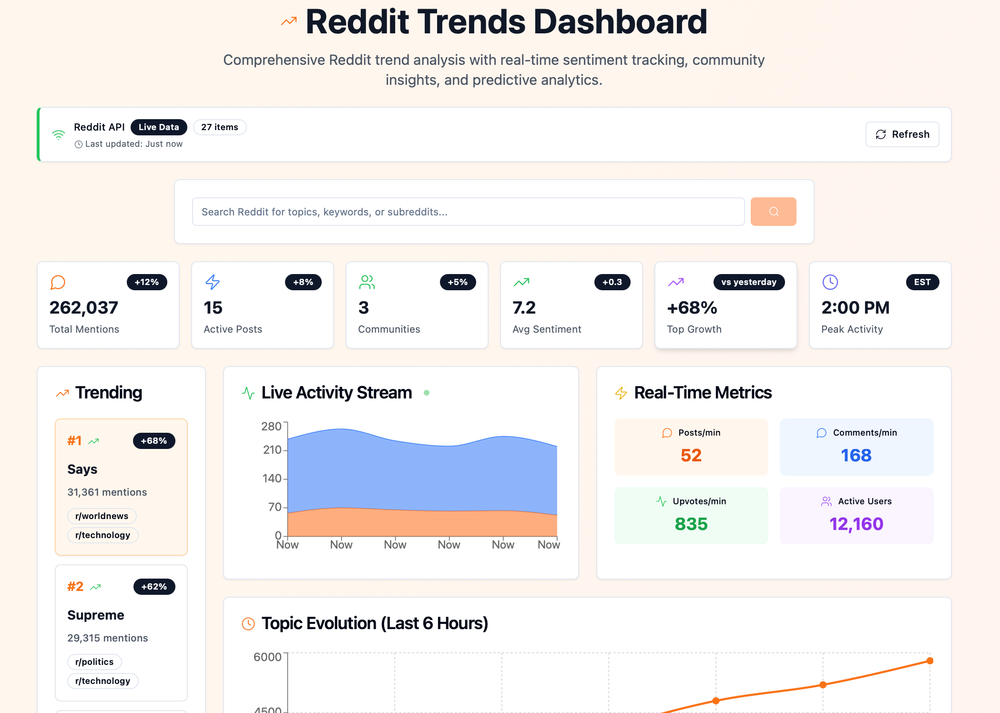

<div align="center">

# Reddit Trends Dashboard

**A comprehensive Reddit trend analysis application built with React, TypeScript, and modern web technologies.**

[](https://www.gnu.org/licenses/agpl-3.0)
[](https://reactjs.org/)
[](https://www.typescriptlang.org/)
[](https://tailwindcss.com/)

[🚀 Live Demo](https://reddittrends.rawveg.co.uk) • [📖 Documentation](#features) • [🐛 Report Bug](https://github.com/rawveg/reddit-trends-dashboard/issues) • [💡 Request Feature](https://github.com/rawveg/reddit-trends-dashboard/issues)

---

*This dashboard provides real-time sentiment tracking, community insights, and predictive analytics for Reddit content.*

</div>



## 🚀 Features

### Core Analytics
- **Real-time Trending Topics**: Live tracking of trending discussions across multiple subreddits
- **Sentiment Analysis**: Comprehensive sentiment scoring with positive/neutral/negative breakdowns
- **Community Distribution**: Analysis of which subreddits are driving conversations
- **Engagement Metrics**: Upvotes, comments, and interaction tracking
- **Geographic Trends**: Regional analysis of topic popularity

### Advanced Visualizations
- **Topic Evolution Charts**: Track how topics trend over time
- **Activity Heatmaps**: Visualize posting patterns by day and hour
- **Network Graphs**: See relationships between topics and communities
- **Velocity & Momentum**: Track how quickly topics are gaining traction
- **Keyword Clouds**: Identify trending keywords and phrases

### Interactive Features
- **Smart Search**: Search Reddit with comprehensive analytics
- **Clickable Keywords**: Explore related topics by clicking on trending keywords
- **Live Feed**: Real-time stream of new posts and discussions
- **Custom Alerts**: Set up notifications for trending topics
- **Comparison Tools**: Compare multiple topics side-by-side

### Data Sources
- **Reddit API Integration**: Fetches live data from multiple subreddits
- **CORS Proxy Support**: Handles browser restrictions for development
- **Rate Limiting**: Intelligent request throttling to respect API limits
- **Error Handling**: Robust error recovery and user feedback

## 🛠️ Tech Stack

- **Frontend**: React 18.3.1 with TypeScript
- **Styling**: Tailwind CSS with shadcn/ui components
- **Charts**: Recharts for data visualization
- **Routing**: React Router DOM
- **State Management**: React hooks and context
- **Data Fetching**: Custom Reddit API service
- **Icons**: Lucide React
- **Build Tool**: Vite
- **Containerization**: Docker with multi-stage builds

## 📋 Prerequisites

### Local Development
- Node.js 18+ 
- npm or yarn package manager
- Modern web browser with ES2020+ support

### Docker Deployment
- Docker 20.10+
- Docker Compose 2.0+ (optional)

## 🚀 Quick Start

### Option 1: Local Development

#### 1. Clone the Repository

```bash
git clone <repository-url>
cd reddit-trends-dashboard
```

#### 2. Install Dependencies

```bash
npm install
# or
yarn install
```

#### 3. Start Development Server

```bash
npm run dev
# or
yarn dev
```

The application will be available at `http://localhost:8080`

#### 4. Build for Production

```bash
npm run build
# or
yarn build
```

### Option 2: Docker Deployment

#### Quick Start with Docker

```bash
# Clone the repository
git clone <repository-url>
cd reddit-trends-dashboard

# Build and run with Docker
docker build -t reddit-trends-dashboard .
docker run -p 3000:80 reddit-trends-dashboard
```

The application will be available at `http://localhost:3000`

#### Using Docker Compose

```bash
# Start the application
docker-compose up -d

# View logs
docker-compose logs -f

# Stop the application
docker-compose down
```

#### Production Docker Deployment

```bash
# Build for production
docker build -t reddit-trends-dashboard:latest .

# Run with custom port and environment
docker run -d \
  --name reddit-trends \
  -p 80:80 \
  --restart unless-stopped \
  reddit-trends-dashboard:latest

# Check health
docker exec reddit-trends wget --spider http://localhost/health
```

## 🔧 Configuration

### Environment Variables

Create a `.env` file in the root directory for any custom configuration:

```env
# Optional: Custom CORS proxy URL
VITE_CORS_PROXY_URL=https://api.allorigins.win/raw?url=

# Optional: Reddit API credentials (for production use)
VITE_REDDIT_CLIENT_ID=your_client_id
VITE_REDDIT_CLIENT_SECRET=your_client_secret
```

### Docker Environment Variables

```bash
# Set environment variables for Docker
docker run -p 3000:80 \
  -e VITE_CORS_PROXY_URL=https://your-proxy.com \
  reddit-trends-dashboard
```

### Reddit API Setup (Optional)

For production deployment with higher rate limits:

1. Go to [Reddit App Preferences](https://www.reddit.com/prefs/apps)
2. Create a new application (select "web app")
3. Note your client ID and secret
4. Add them to your environment variables

## 📖 Usage Guide

### Dashboard Overview

The main dashboard provides several key sections:

1. **Header Metrics**: Overview of total mentions, posts, communities, and sentiment
2. **Trending Topics**: Left sidebar showing current trending topics
3. **Analytics Charts**: Main area with various visualizations
4. **Live Feed**: Real-time stream of new posts
5. **Search**: Comprehensive search with detailed analytics

### Searching for Topics

1. **Basic Search**: Enter any keyword or topic in the search bar
2. **Keyword Exploration**: Click on any keyword in search results to explore related topics
3. **Advanced Analytics**: View sentiment, community distribution, and engagement metrics
4. **Clear Search**: Return to the main dashboard anytime

### Understanding the Charts

- **Topic Evolution**: Shows how topics trend over time
- **Sentiment Analysis**: Pie chart and timeline of positive/negative sentiment
- **Community Distribution**: Which subreddits are most active for a topic
- **Activity Heatmap**: When topics are most active (by day/hour)
- **Network Graph**: Relationships between topics and communities

### Setting Up Alerts

1. Navigate to the "Alerts" tab
2. Enter a keyword and mention threshold
3. Enable the alert toggle
4. Receive notifications when thresholds are exceeded

## 🐳 Docker Details

### Multi-Stage Build

The Dockerfile uses a multi-stage build process:

1. **Builder Stage**: Installs dependencies and builds the React app
2. **Production Stage**: Serves the built app with nginx

### Container Features

- **Lightweight**: Based on Alpine Linux for minimal size
- **Optimized**: Multi-stage build reduces final image size
- **Secure**: Includes security headers and best practices
- **Health Checks**: Built-in health monitoring
- **Caching**: Optimized nginx configuration for static assets

### Container Management

```bash
# View running containers
docker ps

# Check container logs
docker logs reddit-trends-dashboard

# Execute commands in container
docker exec -it reddit-trends-dashboard sh

# Update container
docker pull reddit-trends-dashboard:latest
docker stop reddit-trends-dashboard
docker rm reddit-trends-dashboard
docker run -d --name reddit-trends-dashboard -p 3000:80 reddit-trends-dashboard:latest
```

## 🔍 API Integration

### Reddit Data Sources

The app fetches data from these Reddit endpoints:

- `/r/{subreddit}/hot.json` - Hot posts from specific subreddits
- `/search.json` - Search across all of Reddit
- Public JSON feeds (no authentication required)

### Supported Subreddits

Default subreddits monitored:
- r/technology
- r/worldnews  
- r/science
- r/politics
- r/gaming
- r/MachineLearning
- r/artificial
- r/climate
- r/environment
- r/CryptoCurrency
- r/SpaceX
- r/programming

### Rate Limiting

The app implements intelligent rate limiting:
- Minimum 2 seconds between requests
- Exponential backoff on rate limit errors
- Automatic retry with increasing delays
- User feedback on rate limit status

## 🚨 Troubleshooting

### Common Issues

**CORS Errors (Development)**
- The app uses a CORS proxy for development
- If proxy is down, try refreshing or waiting a few minutes
- For production, deploy to a domain to avoid CORS issues

**Rate Limiting**
- Reddit limits API requests to prevent abuse
- The app will automatically retry when limits reset
- Avoid manual refreshes when rate limited

**No Data Loading**
- Check your internet connection
- Verify Reddit is accessible
- Try the "Test Proxy" button in the data source indicator

**Search Not Working**
- Ensure you're not rate limited
- Try simpler search terms
- Check the error message in the data source indicator

### Docker Issues

**Container Won't Start**
```bash
# Check container logs
docker logs reddit-trends-dashboard

# Verify port availability
netstat -tulpn | grep :3000
```

**Build Failures**
```bash
# Clear Docker cache
docker system prune -a

# Rebuild without cache
docker build --no-cache -t reddit-trends-dashboard .
```

**Permission Issues**
```bash
# Fix file permissions
chmod +x docker-entrypoint.sh

# Run with specific user
docker run --user $(id -u):$(id -g) reddit-trends-dashboard
```

### Development Issues

**Build Errors**
```bash
# Clear node modules and reinstall
rm -rf node_modules package-lock.json
npm install
```

**TypeScript Errors**
```bash
# Check TypeScript configuration
npx tsc --noEmit
```

**Styling Issues**
```bash
# Rebuild Tailwind CSS
npm run build:css
```

## 🚀 Deployment

### Production Deployment Options

#### 1. Docker on VPS/Cloud

```bash
# Deploy to production server
docker build -t reddit-trends-dashboard .
docker run -d \
  --name reddit-trends \
  -p 80:80 \
  --restart unless-stopped \
  reddit-trends-dashboard
```

#### 2. Docker with Reverse Proxy

```yaml
# docker-compose.prod.yml
version: '3.8'
services:
  app:
    build: .
    restart: unless-stopped
  
  nginx:
    image: nginx:alpine
    ports:
      - "80:80"
      - "443:443"
    volumes:
      - ./nginx.conf:/etc/nginx/nginx.conf
      - ./ssl:/etc/nginx/ssl
    depends_on:
      - app
```

#### 3. Kubernetes Deployment

```yaml
# k8s-deployment.yaml
apiVersion: apps/v1
kind: Deployment
metadata:
  name: reddit-trends-dashboard
spec:
  replicas: 3
  selector:
    matchLabels:
      app: reddit-trends-dashboard
  template:
    metadata:
      labels:
        app: reddit-trends-dashboard
    spec:
      containers:
      - name: reddit-trends-dashboard
        image: reddit-trends-dashboard:latest
        ports:
        - containerPort: 80
```

## 🤝 Contributing

We welcome contributions! Please follow these steps:

1. Fork the repository
2. Create a feature branch (`git checkout -b feature/amazing-feature`)
3. Commit your changes (`git commit -m 'Add amazing feature'`)
4. Push to the branch (`git push origin feature/amazing-feature`)
5. Open a Pull Request

### Development Guidelines

- Follow TypeScript best practices
- Use existing component patterns
- Add proper error handling
- Include responsive design
- Test on multiple browsers
- Document new features
- Test Docker builds before submitting

### Code Style

- Use TypeScript for all new code
- Follow existing naming conventions
- Use Tailwind CSS for styling
- Prefer functional components with hooks
- Add proper type definitions

## 📄 License

This project is licensed under the GNU Affero General Public License v3.0 (AGPL-3.0). See [LICENSE](LICENSE)

### What this means:

- ✅ **Free to use**: You can use this software for any purpose
- ✅ **Free to modify**: You can change the code to suit your needs
- ✅ **Free to distribute**: You can share the software with others
- ⚠️ **Copyleft**: If you distribute modified versions, you must also distribute the source code
- ⚠️ **Network use**: If you run this software on a server, users must be able to access the source code

### Full License

See the [LICENSE](LICENSE) file for the complete AGPL-3.0 license text.

### Why AGPL-3.0?

We chose AGPL-3.0 to ensure that improvements to this software remain open source, even when used in web services. This promotes collaboration and prevents proprietary forks.

## 🙏 Acknowledgments

- **Reddit**: For providing public JSON feeds
- **shadcn/ui**: For the excellent component library
- **Recharts**: For powerful charting capabilities
- **Tailwind CSS**: For utility-first styling
- **Lucide**: For beautiful icons
- **Vite**: For fast development experience
- **Docker**: For containerization platform
- **nginx**: For high-performance web server

## 📞 Support

- **Issues**: Report bugs on GitHub Issues
- **Discussions**: Join GitHub Discussions for questions
- **Documentation**: Check this README and inline code comments
- **Community**: Connect with other users and contributors

## 🗺️ Roadmap

### Upcoming Features

- [ ] Real Reddit API authentication
- [ ] Historical data storage
- [ ] Custom dashboard layouts
- [ ] Export functionality
- [ ] Mobile app version
- [ ] Advanced filtering options
- [ ] Machine learning predictions
- [ ] Multi-platform support (Twitter, etc.)
- [ ] Kubernetes Helm charts
- [ ] CI/CD pipeline integration

### Performance Improvements

- [ ] Data caching layer
- [ ] Optimized chart rendering
- [ ] Lazy loading for large datasets
- [ ] Service worker for offline support
- [ ] Container image optimization
- [ ] CDN integration

---

**Built with ❤️ using modern web technologies and containerized for easy deployment**

For more information, visit our [GitHub repository](https://github.com/rawveg/reddit-trends-dashboard).
